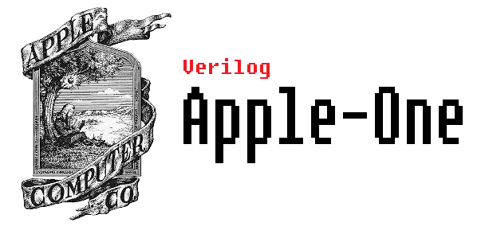
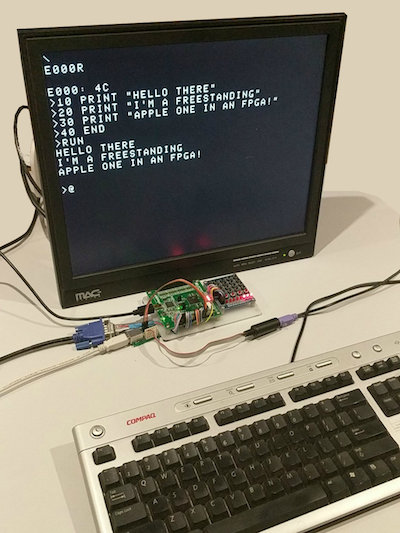

This is a basic implementation of the original Apple 1 in Verilog. It can run the Apple 1 WozMon and Integer Basic via the serial or VGA 640x480 video with PS/2 keyboard standalone. This makes this a very compact little set up. So far fully tested and supported boards are:
- iCE40HX8K-B-EVN breakout
- Terasic DE0



This project borrows heavily from the *awesome* work of Andrew Holme and his ["Pool"](http://www.aholme.co.uk/6502/Main.htm) project where he built a 6502 CPU core in Verilog using the netlist from the Visual 6502 project. Amazing stuff, and so far seems to work perfectly. Also many special thanks to ["sbprojects.com"](https://www.sbprojects.com/projects/apple1/index.php) for the wealth of information I gleaned from there.

 ## Memory Map
 
The memory map is currently set up to have:

 Start | End | Description
 ----- | --- | -----------
 0x0000 | 0x1FFF | 8KB of block RAM for system
 0xE000 | 0xEFFF | 4KB of block RAM for basic ROM
 0xFF00 | 0xFFFF | 512B of block RAM for WozMon ROM
 
 ## Building

Each supported board has a directory in `boards`. This directory has a structure where each board can have multiple build environments (eg. yosys, icecube2, quartus etc).

To build for your board you just need to open the project or use the `Makefile` that's compatible with your board.

eg.
```
$ cd boards/ice40hx8k-b-evn/yosys/
$ make
```

 ## Serial Setup
 
 To communicate with the Apple 1 you need to use the second channel serial interface for the iCE40HX8K-B-EVN board. This should appear as a COM port on you PC. This project is configured to use the 12MHz onboard clock to generate the baud rate, and as such I've selected 19200 baud (8/N/1).
 
 A very very basic hardware flow control is implemented too. You should turn on CTS support as this will allow you to cut and paste code into the Woz Mon without the Apple 1 missing any bytes.
 
 ## Helping
 
 All PRs and suggestions happily accepted! Please any support us most welcome, and it would be good to have this as feature complete as possible with the real Apple1. I'd like to implement the cassette interface next with the basic electronics to talk to the headphone/mic jack of a mobile phone to upload and download recordings as a means to save programs.
 
 But yes, help happily accepted!
